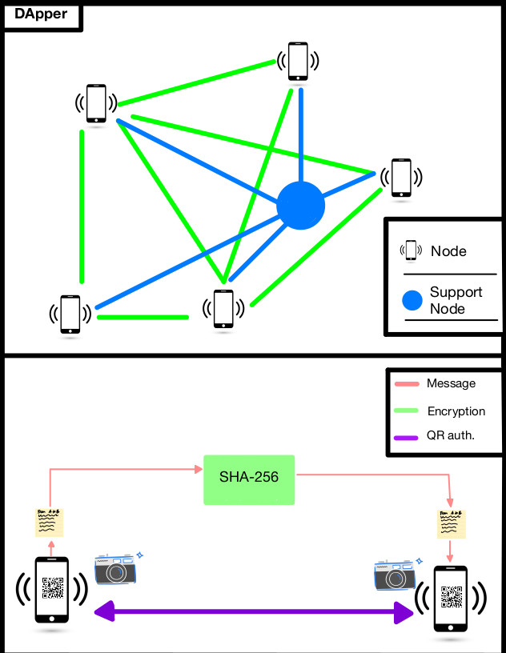

# DApper (spider messenger)
Dectentralized messenger / Comp Security Final project 

## possible mechanisms 

### Block chain piggy back 

- [dart](https://ethereum.org/en/developers/docs/programming-languages/dart/)
- https://pub.dev/packages/web3dart
- [python](https://ethereum.org/en/developers/docs/programming-languages/python/)
- [python](https://levelup.gitconnected.com/dapps-development-for-python-developers-f52b32b54f28)
- https://ipdb.io/resources/
- https://github.com/bigchaindb
- https://dev.to/gcrsaldanha/persist-data-to-the-ethereum-blockchain-using-python-truffle-and-ganache-47lb

### using a decentralized graph data base (gunDB)

- we have decided to go this route and will be using sveltekit with gunDB.
- here is a representation of our basic idea wherein each phone/ user is a node in the graph.

